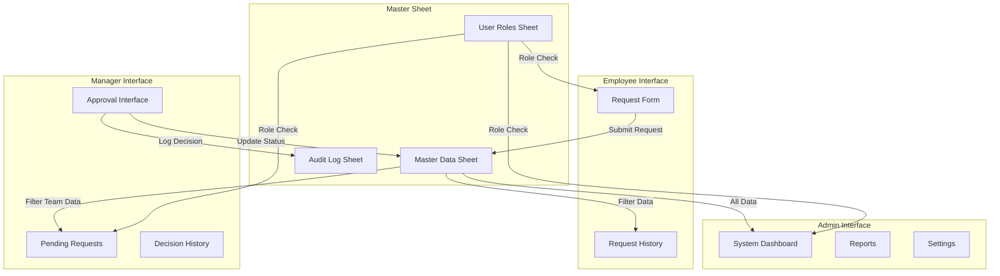
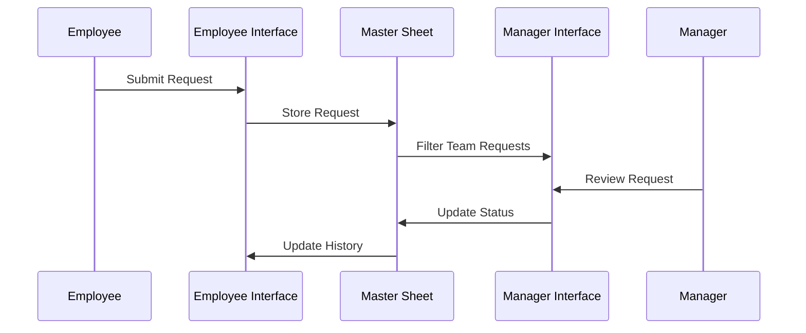
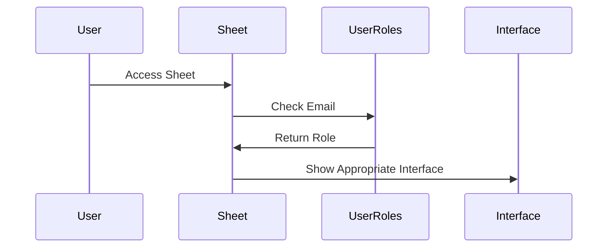

# System Patterns

## Architecture Overview



## Core Design Patterns

### 1. Sheet Structure
- **Master Sheet**
  - LeaveRequests (main data)
  - UserRoles (role mapping)
  - AuditLog (system events)
  - Settings (system configuration)

- **Employee Sheet**
  - RequestForm (input interface)
  - RequestHistory (filtered view)
  - Instructions (help/guidance)

- **Manager Sheet**
  - PendingRequests (action needed)
  - TeamHistory (all team requests)
  - DecisionLog (manager's actions)

- **Admin Sheet**
  - Dashboard (system overview)
  - Reports (data analysis)
  - Settings (system management)

### 2. Data Flow Patterns

#### Leave Request Flow


#### Role-Based Access Pattern


### 3. Security Patterns

#### Data Protection
- Separate sheets for different roles
- Hidden system sheets
- Protected ranges
- Role-based filtering

#### Access Control
- Email-based role mapping
- Sheet-level permissions
- Range protections
- Formula-based data filtering

### 4. Automation Patterns

#### Request Processing
1. Capture form submission
2. Generate unique ID
3. Assign manager
4. Update master data
5. Notify relevant parties

#### Approval Processing
1. Capture manager decision
2. Update request status
3. Log decision details
4. Update audit trail
5. Notify employee

### 5. Integration Patterns

#### Cross-Sheet Data Flow
- IMPORTRANGE for data access
- QUERY for filtering
- Named ranges for consistency
- Protected formulas

#### Notification System
- Trigger-based emails
- Status updates
- Decision notifications
- Reminder system

## Technical Implementation

### 1. Apps Script Structure
```javascript
// Core modules
- RoleManager
- RequestProcessor
- ApprovalHandler
- NotificationSystem
- AuditLogger

// Utility modules
- IDGenerator
- DataValidator
- SecurityChecker
- EmailFormatter
```

### 2. Key Functions
```javascript
// Role management
function getUserRole()
function validateAccess()

// Request handling
function processNewRequest()
function generateLeaveID()
function assignManager()

// Approval handling
function processApproval()
function updateStatus()
function logDecision()

// Notifications
function sendNotification()
function emailUpdates()
```

### 3. Data Validation
- Input validation
- Role verification
- Date range checks
- Status transitions
- Duplicate prevention

### 4. Error Handling
- Input validation errors
- Permission issues
- System constraints
- Concurrent access
- Formula errors
